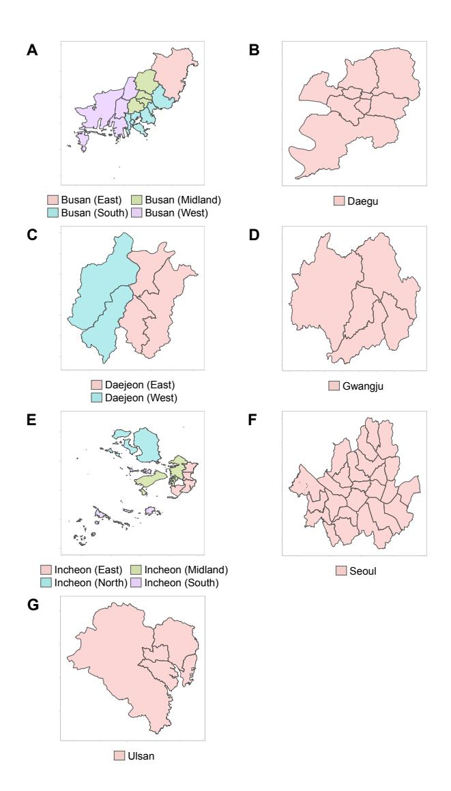
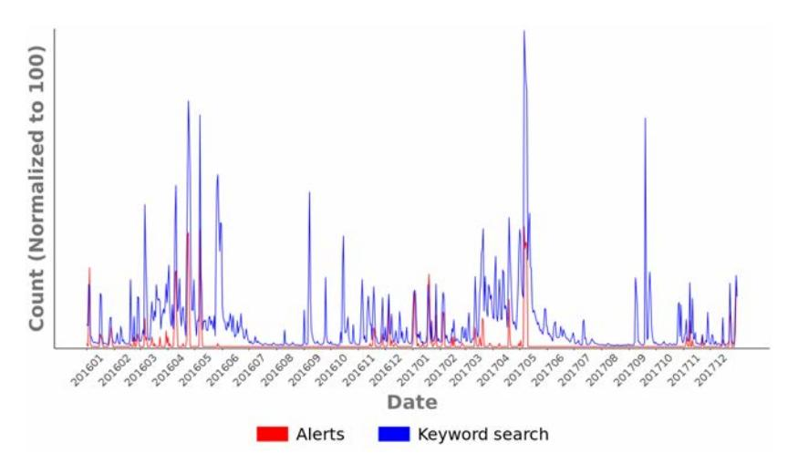
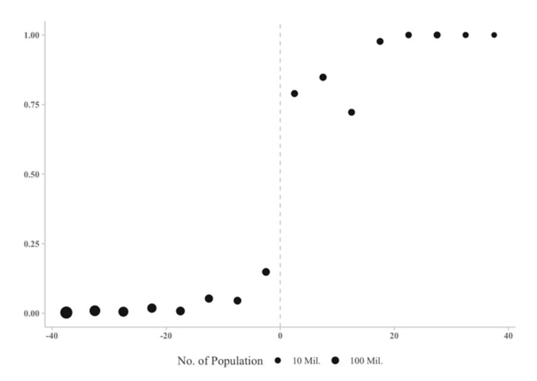
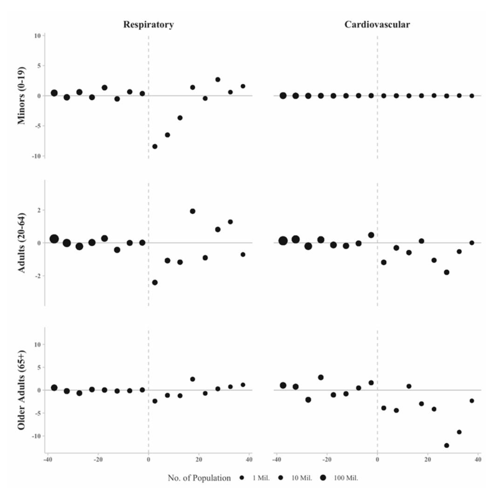
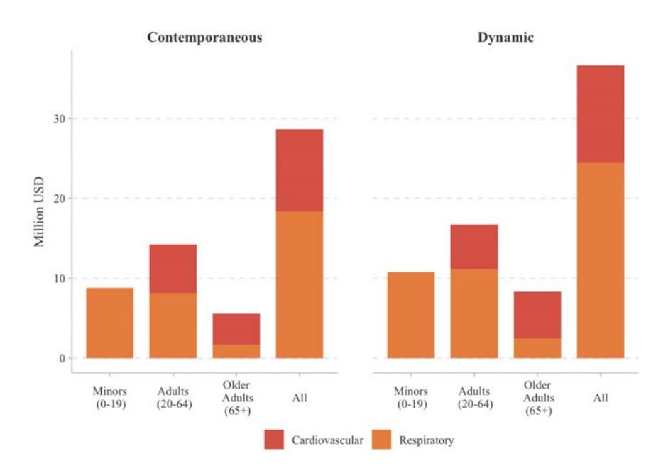
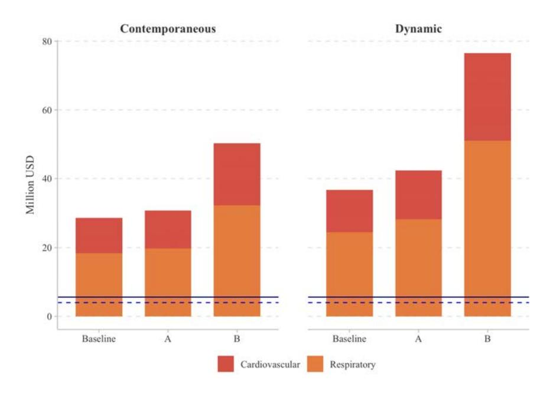

## Bibliographic metadata
doi: null
authors: [Anderson, Hyun, Lee]
title: "Bounds, Benefits, and Bad Air: Welfare Impacts of Pollution Alerts"
year: 2022
venue: NBER Working Paper No. 29637
venue_type: working_paper

## Plain-English synthesis

Governments in many countries issue air-quality alerts when pollution crosses dangerous thresholds. These alerts warn people and recommend protective actions (staying indoors, wearing masks, reducing outdoor exercise). Despite covering over 1.7 billion people worldwide, almost nothing was known about whether these alert systems actually improve welfare. This paper studies South Korea's PM alert system, which covers 51 million people.

The authors use a clever research design: alerts are issued when a running measure of PM pollution crosses a threshold. Just above the threshold, alerts are much more likely; just below, they rarely happen. This "fuzzy" discontinuity lets them isolate the causal effect of receiving an alert, separate from the pollution itself — they confirm that ambient PM doesn't jump at the threshold, so any health changes must come from alert-induced behavior.

They find that alerts meaningfully reduce healthcare spending. Youth respiratory spending falls by about 30%, adult and older-adult cardiovascular spending falls by 14–23%. Aggregating over the two-year study period, the alert system reduced government-borne health costs by $28.6 million. The system cost $4 million to run, giving a minimum benefit-cost ratio of 7:1.

The key conceptual insight is that the government's spending reduction is a *lower bound* on the total welfare gain: the remaining private benefits (avoided illness, reduced discomfort) can only add to it. The system is highly cost-effective on the most conservative possible calculation.

## 1. Research question

What are the welfare impacts of an air-quality alert system (AQAS)? Specifically: do alerts induce avoidance behavior that reduces health expenditures, and what is the lower bound on net social welfare gain, accounting for the fact that avoidance behavior itself carries costs?

Motivation: AQAS cover billions of people globally, yet empirical welfare evidence has been lacking. Prior work studied health responses to pollution levels, not the incremental value of public information provision about pollution. Paper distinguishes AQAS (information-only intervention with no effect on ambient pollution) from emission-control programs.

## 2. Audience

Environmental and health economists studying information provision, avoidance behavior, and the externalities of public health systems. Policy analysts designing or evaluating air-quality warning programs in countries with high pollution and large public health expenditures (particularly relevant for middle-income countries where South Korean PM levels are more representative than those in the US literature).

## 3. Method / identification strategy

**Fuzzy regression discontinuity (FRD)** exploiting exogenous variation in alert issuance at a PM concentration threshold.

Running variable: daily maximum of 2-hour-minimum PM, threshold-normalized. PM2.5 threshold = 90 µg/m³ (lowered to 75 µg/m³ from March 2018); PM10 threshold = 150 µg/m³. Running variable $rv_d = PM_d^{\text{2h-min-max}} - c$, rounded to nearest integer. Treatment threshold = 0.

Alert issuance is not mechanical (weather conditions also matter; issuance and cancellation thresholds differ), making this a fuzzy RD. First stage shows alert probability rises ~62 pp when $rv_d$ crosses zero.

Key identification assumption: no discontinuous change in ambient PM or pre-determined covariates at the threshold — confirmed empirically (Table A4: PM coefficients near zero; Figure A3: no break in temperature or precipitation).

Local linear regression with bandwidth $h = 20$ (CCT-optimal range: 17–22); robustness checks at $h = 16$ and $h = 24$.

## 4. Target parameter

**Contemporaneous LATE**: effect of receiving a PM alert (for compliers at the threshold) on same-day per-capita health expenditures in cents (respiratory or cardiovascular, by age group).

**Dynamic LATE (Eq. 8)**: cumulative 3-day effect, capturing multi-day alert duration (average alert length ≈ 1.87 days).

**Welfare lower bound**: $\Delta E_i$ = reduction in publicly reimbursed health expenditures ($\approx 70\%$ of total), which is a lower bound on total welfare gain $\Delta W_i = \Delta U_i + \Delta E_i$ since $\Delta U_i \geq 0$ (accurate information about pollution weakly increases private utility).

## 5. Data

- **Country / period**: South Korea, 2016–2017 (ozone season equivalent: full year).
- **Unit of observation**: district-by-day (73 districts, 14 alert regions in 7 major cities: Seoul, Busan, Daegu, Daejeon, Incheon, Gwangju, Ulsan; combined population ≈ 23 million = 44% of South Korea).
- **Health spending**: National Health Insurance Service (NHIS) daily per-capita expenditures by district; 10% random sample of insured individuals ($\approx 2.3$ million). Covers cardiovascular (ICD-10 "I") and respiratory (ICD-10 "J") disease categories, by age group (Minors 0–19, Adults 20–64, Older Adults 65+). Excludes inpatient stays and tertiary outpatient visits from main analysis to avoid temporal-lag bias. Unit: US cents/capita (11.5 KRW = 0.01 USD).
- **Alert data**: Korea Environment Corporation (KECO)/AirKorea website; 134 unique alerts, 80 lasting >1 day, average length ≈ 1.87 days; 230 region-days / 1,427 district-days with alerts in 2016–2017.
- **PM data**: PM2.5 and PM10 monitoring station data; running variable construction based on hourly PM readings.
- **Summary statistics (Table 2)**: Full sample: 53,363 district-day observations; BW=40 sample: 10,547 observations. PM2.5 full-sample mean 25.1 µg/m³ (BW-40: 41.8), PM10 full-sample mean 44.5 µg/m³ (BW-40: 68.4), precipitation mean 3.1 mm, temperature mean 13.8 °C.

## 6. Statistical methods / specifications

**First-stage regression (Eq. 5)**:

$$
\text{Alert}_{it} = \gamma_0 + \gamma_1 \mathbf{1}[\widetilde{PM}_{it} \geq 0] + \gamma_2 \widetilde{PM}_{it} + \gamma_3 \widetilde{PM}_{it} \cdot \mathbf{1}[\widetilde{PM}_{it} \geq 0] + X_{1it}' \lambda + X_{2t}' \mu + \delta_i + \varepsilon_{it}
$$

**Reduced form (Eq. 6)**:

$$
Y_{it} = \beta_0 + \beta_1 \mathbf{1}[\widetilde{PM}_{it} \geq 0] + \beta_2 \widetilde{PM}_{it} + \beta_3 \widetilde{PM}_{it} \cdot \mathbf{1}[\widetilde{PM}_{it} \geq 0] + X_{1it}' \lambda + X_{2t}' \mu + \delta_i + \varepsilon_{it}
$$

**FRD LATE via 2SLS (Eq. 7)**:

$$
\hat{\tau}_{\text{FRD}} = \frac{\hat{\beta}_1}{\hat{\gamma}_1}
$$

**Dynamic specification (Eq. 8)**: 3-day rolling sum $Y_{it}^+ = \sum_{s=0}^{2} Y_{i,t+s}$ as dependent variable; alert days preceded by another alert day dropped to avoid double-counting.

Controls ($X_1$): temperature, precipitation. Fixed effects ($X_2$): year × month, day-of-week, holiday. District FEs ($\delta_i$). Population-weighted regressions. Standard errors double-clustered: by running-variable value (in parentheses) and by day of sample (in square brackets) — use whichever yields larger t-statistics for conservative inference. Adjusted $R^2 \approx 0.8$–$0.9$ in outcome equations.

Robustness: quadratic RV specification (Table A8); PM10/PM2.5/AQI as covariates (Table A9); alternative clustering (Table A10); spatial spillover via nearest-neighbor alert region (Table A11); placebo thresholds at $-20$, $-30$, $-50$ units from true threshold (Table A11).

**Running variable construction (Appendix A2)**:

$$
PM_{dh}^{\text{2h-min}} = \min\{PM_{d,h-1}, PM_{d,h}\}
\qquad
PM_d^{\text{2h-min-max}} = \max_h\{PM_{dh}^{\text{2h-min}}\}
\qquad
rv_d = \text{round}(PM_d^{\text{2h-min-max}} - c)
$$

## 7. Findings

**First stage (Table 3)**:

| Bandwidth | 1(RV≥0) coeff. | First-stage F | Adj. R² |
|---|---|---|---|
| h = 16 | 0.618 | 89.7 | 0.728 |
| h = 20 | 0.628 | — | 0.718 |
| h = 24 | 0.636 | 46.0 | 0.708 |

Alert probability rises ~62 pp when running variable crosses zero (strong first stage).

**Table 4: Respiratory disease — 2SLS estimates, h = 20** (US cents per capita)

| Age group | 2SLS coeff. | SE (RV-clustered) | SE (day-clustered) | % of mean |
|---|---|---|---|---|
| Minors (0–19) | −15.03 | (4.71) | [5.67] | −30% |
| Adults (20–64) | −3.78 | (2.20) | [2.13] | — |
| Older Adults (≥65) | −4.30 | (2.75) | [2.80] | — |
| All ages | −5.83 | (2.40) | [2.50] | — |

Notes: Local-linear 2SLS. Running variable, RV × above-threshold interaction, temperature, precipitation, year × month FE, day-of-week FE, district FE. SE in parentheses clustered by running-variable value; SE in square brackets clustered by day of sample.

**Table 5: Cardiovascular disease — 2SLS estimates, h = 20** (US cents per capita)

| Age group | 2SLS coeff. | SE (RV-clustered) | SE (day-clustered) | % of mean |
|---|---|---|---|---|
| Minors (0–19) | −0.040 | (0.032) | [0.035] | — |
| Adults (20–64) | −2.83 | (0.976) | [0.767] | −23% |
| Older Adults (≥65) | −9.64 | (3.85) | [3.68] | −14% |
| All ages | −3.26 | (1.09) | [1.01] | — |

Notes: Same specification as Table 4.

**Table 6: Dynamic effects — 2SLS 3-day rolling sum, h = 20** (US cents per capita)

| | Minors | Adults | Older Adults | All |
|---|---|---|---|---|
| Respiratory | −38.2 (11.6) | −10.7 (3.95) | −13.0 (4.95) | −16.1 (4.78) |
| Cardiovascular | near zero | −5.28 (1.91) | −30.4 (12.2) | −8.04 (2.66) |

Notes: 3-day cumulative spending (days $t$ through $t+2$). Excludes district-days preceded by an alert day to avoid double-counting. SE in parentheses clustered by running-variable value. $N = 2{,}530$ main; $N = 2{,}228$ excluding prior-alert days.

**Aggregate welfare effects**:
- Contemporaneous total health expenditure reduction: ≈$41M (2016–2017); public share (lower bound): $28.6M (respiratory $18.4M + cardiovascular $10.2M).
- Dynamic total: ≈$52M; public share lower bound: $36.7M (respiratory $24.5M + cardiovascular $12.2M).
- Alert system management cost: $4M (2016–2017; city-level records, Tables A12–A13: $2.0M in 2017 + $2.8M in 2018).
- **Benefit-cost ratio: 7.1:1** (contemporaneous); **9.2:1** (dynamic).
- Net benefit: $24.6M (contemporaneous); $32.7M (dynamic).

**Age heterogeneity**: Minors benefit most from respiratory effects; adults and older adults benefit most from cardiovascular effects. Dollar aggregates: minors $12.6M, prime-age adults $20.4M, older adults $8M.

**Policy simulation**: Full compliance (sharp RD) would add $5.7M; lowering PM2.5 threshold from 90 to 75 µg/m³ would have reduced total health expenditures by $76.5M (109% increase over baseline).

**Robustness**: No PM discontinuity at threshold (Table A4). No covariate discontinuity (Figure A3). McCrary density test: no missing density above threshold (Figures A1, A2). Estimates stable across quadratic RV (Table A8), air-quality covariates (Table A9), clustering (Table A10). No spatial spillover; placebo thresholds insignificant (Table A11).

## 8. Contributions

1. First welfare analysis of an air-quality alert system (distinct from emission-control programs): uses health expenditure data + theoretical bounds to estimate net benefits net of avoidance behavior costs.
2. First regression discontinuity design to identify causal health impacts of AQAS (prior work used time-series or DID).
3. Establishes novel mechanism: effects are purely via avoidance behavior (no discontinuous change in ambient PM at threshold), not via informing pollution itself.
4. First causal evidence that AQAS effects extend beyond respiratory disease (cardiovascular effects for working-age and older adults).
5. Context more representative of middle-income country pollution levels than prior US-focused literature.
6. Framework ($\Delta W = \Delta U + \Delta E$; lower-bound identification via public expenditure reduction) generalizable to other information-provision contexts (restaurant hygiene cards, electricity usage information, hospital report cards).

## 9. Replication feasibility

**Rating: LOW.**

- Health spending micro-data: South Korean NHIS data, restricted to Korean data centers. NHIS prohibits sharing processed data. No public replication archive possible.
- Alert data: public (https://www.airkorea.or.kr/); alert timing fully documented.
- PM monitoring data: retrievable from AirKorea.
- Code / specifications: fully described in paper. Standard rdrobust package (Calonico, Cattaneo, Titiunik 2014, 2015) for bandwidth selection. Sufficient to replicate given data access.
- Cost data (Tables A12–A13): from municipal environmental budget records, 7 cities; available via FOIA-equivalent Korean government request.
- Restriction note: 2016 alert system cost assumed equal to 2017 ($2M) because actual 2016 figure unavailable to authors (fn. 30).
- IRB: Korea National Institute for Bioethics Policy IRB P01-201811-22-008.

## 10. Tables (project-relevance gated)

**Directly relevant (extracted above)**: Tables 3–6 (first stage, respiratory and cardiovascular 2SLS, dynamic effects).

**Relevant context, not extracted verbatim**:
- Table 1 (p. 26): PM10 and PM2.5 advisory issuance/cancellation thresholds and recommended behaviors by target group. Source: AirKorea.
- Table 2 (p. 27): Summary statistics for full sample and bandwidth-40 subsample; expenditure means and SDs by disease type, age group, and covariates.
- Table 7–8 (pp. 32–33): Robustness to inclusion of tertiary general hospital visits — all-age respiratory −5.54 (SE 2.37), cardiovascular −3.43 (SE 1.17).
- Table 9 (p. 34): Bandwidth sensitivity (h=16/20/24) and alert timing filter (drop cancelled before 9am or triggered after 7pm) — results stable.

**Appendix tables (less relevant)**:
- Table A1: Global air quality alert system examples (China, South Korea, US, Canada, Australia, Mexico, Singapore, UK) with population covered. (pp. A1–A2)
- Table A2–A3: Korean medical institution types and out-of-pocket payment schedules. (pp. A2–A3)
- Table A4: PM as dependent variable — no discontinuity. (Appendix)
- Table A5: CCT optimal bandwidths, range 17–34 across 16 outcome × age-group combinations. (Appendix)
- Tables A6–A11: Dynamic robustness, asymmetric threshold, quadratic RV, pollution covariates, alternative clustering, spillover + falsification. (Appendix)
- Tables A12–A13: Municipal alert system costs by city (total 2017: $2,014,558; 2018: $2,833,940). (Appendix)

## 11. Figures (project-relevance gated)

**Figure 1:** Alert clusters for seven major South Korean cities (Busan, Daejeon, Daegu, Gwangju, Incheon, Seoul, Ulsan); districts color-coded by alert region cluster. (p. 20)

- Type: Map (Tier B — schematic)
- One-liner: Geographic boundaries of alert clusters within 7 cities; 73 districts across 14 alert regions.
- **Figure notes:** Alert regions within cities.

**Figure 2:** Daily PM alert counts (red) and NAVER search index for air quality keywords (blue), 2016–2017. (p. 21)

- Type: Time series (Tier A)
- X-axis: Date (2016–2017)
- Y-axis: Alert count (red, left); NAVER keyword search index (blue, right; max = 100)
- Series / panels: Alert count series; NAVER search index series
- Key visual finding: NAVER keyword searches for air quality spike sharply on alert days, confirming that alerts successfully transmit information to the public.
- Annotations: Spikes in blue series coincide with red bars; search index reaches 100 on high-alert days.
- **Figure notes:** NAVER is the dominant South Korean search engine; keyword search index is normalized with max = 100.

**Figure 3:** Treatment probability discontinuity — P(PM advisory) vs. running variable; bin width = 5 units, population-weighted. (p. 22)

- Type: Binned scatter (Tier A)
- X-axis: Running variable (threshold-normalized PM; range approximately −40 to +40)
- Y-axis: Probability of PM advisory (range 0–1)
- Series / panels: Single series; local linear fit on each side of threshold
- Key visual finding: Sharp jump in advisory probability at running variable = 0; no advisory below threshold, ≈62% probability above.
- Annotations: Vertical dashed line at RV = 0; fitted lines on each side of threshold.
- **Figure notes:** Bin width = 5 running-variable units. Population-weighted. First-stage F-statistic ~46–90 depending on bandwidth.

**Figure 4:** Outcome discontinuity — residualized per-capita health expenditures (US cents) vs. running variable; 6 panels (respiratory / cardiovascular × minors / adults / older adults). (p. 23)

- Type: Binned scatter, 6-panel (Tier A)
- X-axis: Running variable (each panel)
- Y-axis: Residualized per-capita expenditure in US cents (residualized for DOW, year × month, holiday, district FEs)
- Series / panels: Respiratory (top row) and cardiovascular (bottom row); Minors / Adults / Older Adults (columns)
- Key visual finding: Visible downward jumps in residualized spending at threshold for youth respiratory and adult/older-adult cardiovascular, consistent with 2SLS estimates.
- Annotations: Vertical dashed lines at RV = 0; local linear fits on each side.
- **Figure notes:** Bin width = 5 running-variable units. Population-weighted.

**Figure 5:** Lower bounds on gross health benefits by age group: contemporaneous (left) and dynamic 3-day (right), scaled by 70% public coverage rate. (p. 24)

- Type: Bar chart (Tier A)
- X-axis: Age group (Minors, Adults, Older Adults) × disease type
- Y-axis: Lower bound on gross health benefit (millions USD, public-expenditure share)
- Series / panels: Contemporaneous (left panel) and dynamic 3-day (right panel); respiratory and cardiovascular stacked bars
- Key visual finding: Adults (20–64) account for the largest share of aggregate benefits ($20.4M), driven by cardiovascular effects; respiratory benefits are concentrated in minors.
- Annotations: Dollar totals labeled on bars.
- **Figure notes:** Scaled by 70% public coverage rate. Based on Tables 4–5 (contemporaneous) and Table 6 (dynamic).

**Figure 6:** Cost-benefit comparison under Baseline, Scenario A (full compliance), and Scenario B (lowered PM2.5 threshold to 75 µg/m³). (p. 25)

- Type: Bar/line chart (Tier A)
- X-axis: Policy scenario (Baseline / Scenario A / Scenario B)
- Y-axis: Millions USD
- Series / panels: Gross benefit bars; system maintenance cost line for 2016–2017
- Key visual finding: All three scenarios yield positive net benefits; Scenario B (lower threshold) generates $76.5M in expenditure reductions — 109% above baseline — at marginally higher system cost.
- Annotations: Maintenance cost line at $4M.
- **Figure notes:** 2016 system cost assumed equal to 2017 value ($2M) due to data unavailability.

**Appendix Figures (robustness only — not copied)**:
- Figure A1 (p. 39): Histogram of daily running variable with threshold line — no missing density above 0. One-line: McCrary-type manipulation test for daily PM running variable.
- Figure A2 (p. 39): Histogram of hourly running variable — same test at hourly level. One-line: No evidence of hourly PM reporting manipulation at alert threshold.
- Figure A3 (p. 40): Continuity of temperature and precipitation plotted against running variable, bin width 5, range [−40, 40] — no discontinuity at threshold. One-line: Covariate balance check; weather controls unaffected at RD threshold.

## 12. Equations / formal objects

**Welfare decomposition**:

$$
W_i = U_i(a_i, pm) + E_i \tag{Eq. 3}
$$

$$
\Delta W_i = \Delta U_i + \Delta E_i \tag{Eq. 4}
$$

where $U_i$ is private utility, $E_i$ is fiscal externality (publicly reimbursed health costs), and $\Delta$ denotes the change from receiving the alert. Since $\Delta U_i \geq 0$ (more accurate information weakly helps), $\Delta E_i$ is a lower bound on $\Delta W_i$.

**Utility function (Eq. 1)**:

$$
U_i(a_i, pm) = b_i(a_i) - s_i^{\text{pvt}} \cdot p_s(a_i, pm)
$$

where $a_i$ = avoidance action, $b_i(a_i)$ = benefit of action minus its cost, $s_i^{\text{pvt}}$ = private share of healthcare costs, $p_s(a_i, pm)$ = probability of health event given action and pollution.

**Change in private utility (Eq. 2)**:

$$
\Delta U_i = \left[b_i(a_i(pm^{\text{hi}})) - b_i(a_i(pm^{\text{avg}}))\right] - s_i^{\text{pvt}}\left[p_s(a_i(pm^{\text{hi}}), c) - p_s(a_i(pm^{\text{avg}}), c)\right]
$$

where $pm^{\text{avg}} = 22.7$ µg/m³ (mean PM2.5 below threshold), $pm^{\text{hi}} = 66.7$ µg/m³ (mean above), $c = 57.5$ µg/m³ (PM2.5 near threshold).

**FRD first stage (Eq. 5)**:

$$
\text{Alert}_{it} = \gamma_0 + \gamma_1 \mathbf{1}[\widetilde{PM}_{it} \geq 0] + \gamma_2 \widetilde{PM}_{it} + \gamma_3 \widetilde{PM}_{it} \cdot \mathbf{1}[\widetilde{PM}_{it} \geq 0] + X_{1it}'\lambda + X_{2t}'\mu + \delta_i + \varepsilon_{it}
$$

**FRD reduced form (Eq. 6)**:

$$
Y_{it} = \beta_0 + \beta_1 \mathbf{1}[\widetilde{PM}_{it} \geq 0] + \beta_2 \widetilde{PM}_{it} + \beta_3 \widetilde{PM}_{it} \cdot \mathbf{1}[\widetilde{PM}_{it} \geq 0] + X_{1it}'\lambda + X_{2t}'\mu + \delta_i + \varepsilon_{it}
$$

**FRD LATE (Eq. 7)**:

$$
\hat{\tau}_{\text{FRD}} = \frac{\hat{\beta}_1}{\hat{\gamma}_1}
$$

**Dynamic specification (Eq. 8)**:

$$
Y_{it}^+ = \sum_{s=0}^{2} Y_{i,t+s}
$$

used as dependent variable in place of $Y_{it}$; sample restricted to drop days $t$ preceded by an alert day to avoid double-counting.

**Running variable construction (Appendix A2)**:

$$
PM_{dh}^{\text{2h-min}} = \min\{PM_{d,h-1},\, PM_{d,h}\}
$$

$$
PM_d^{\text{2h-min-max}} = \max_h\{PM_{dh}^{\text{2h-min}}\}
$$

$$
rv_d = \text{round}\!\left(PM_d^{\text{2h-min-max}} - c\right)
$$

**Theoretical generalization (Appendix A1)**: Main model holds when the running variable is an arbitrary increasing function $f(\text{PM})$ of daily PM, not just average daily PM. This formally justifies using the max-2h-min PM as the RD running variable rather than a daily average.

**Cost data**: $c_{\text{alerts}}$: total system management cost from city-level environmental budget reports (Tables A12–A13); 7 cities; $2,014,558 in 2017, $2,833,940 in 2018 (USD; KRW converted at 11.5 KRW/cent). 2016 cost assumed equal to 2017.
