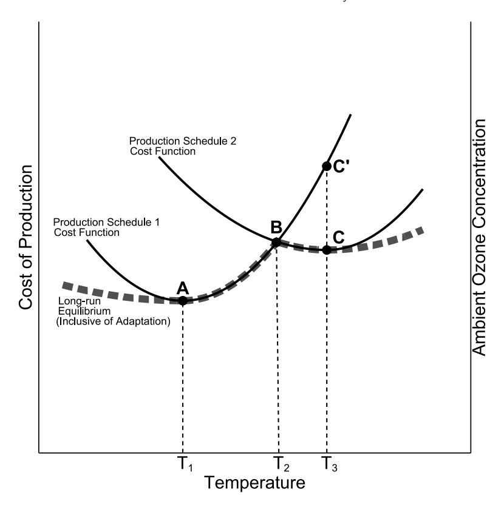
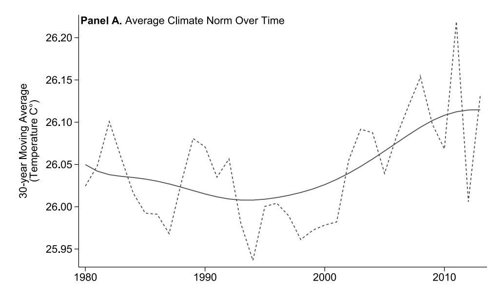
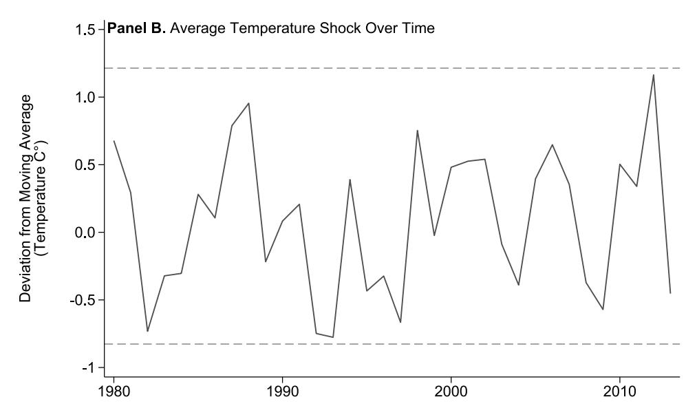
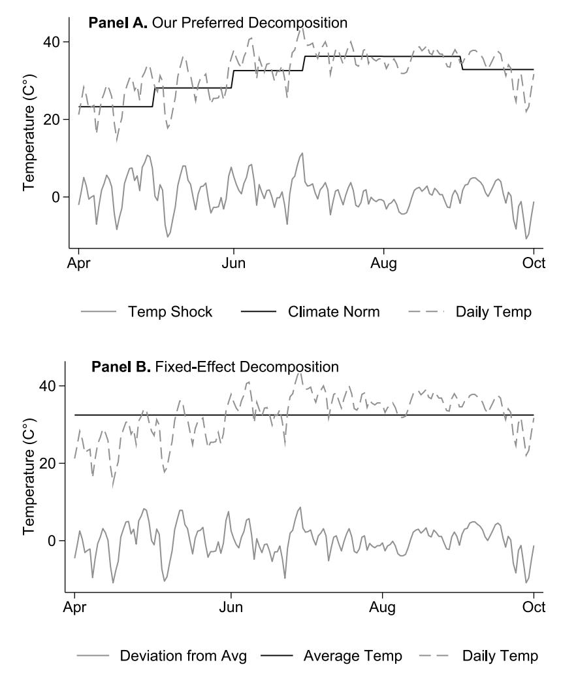
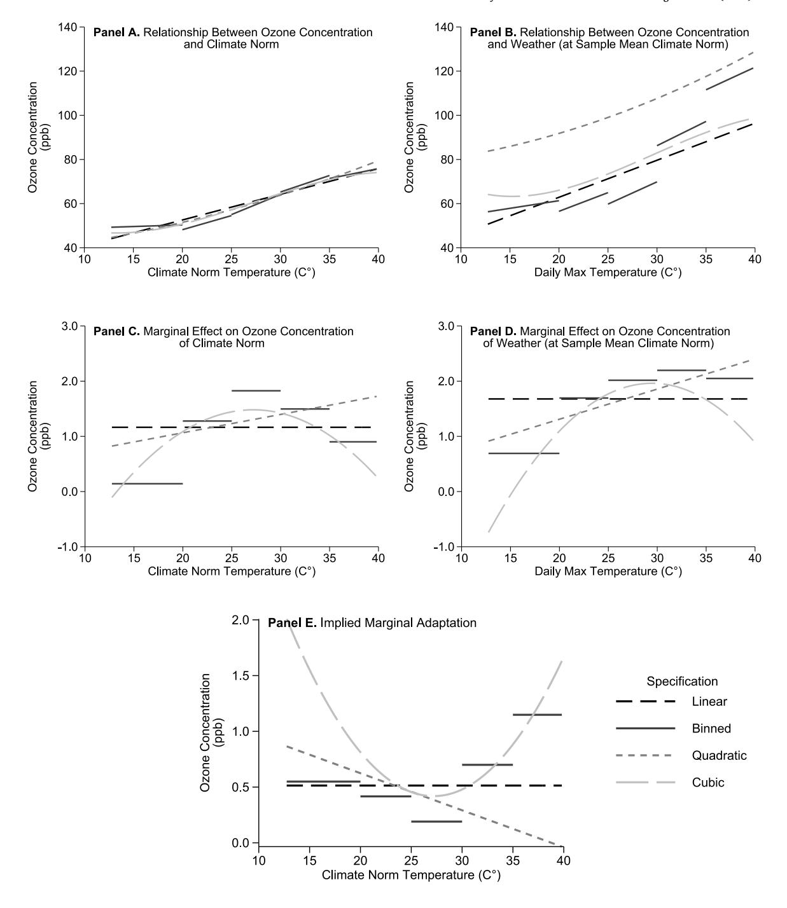

## Bibliographic metadata
doi: 10.1016/j.jeem.2023.102843
authors: [Bento, Miller, Mookerjee, Severnini]
title: A unifying approach to measuring climate change impacts and adaptation
year: 2023
venue: Journal of Environmental Economics and Management
venue_type: journal

## Plain-English synthesis

Climate scientists and economists have struggled to agree on a single number for how much warming raises pollution or crop losses, partly because two popular methods — comparing places with different climates versus tracking day-to-day weather swings — give different answers, and neither alone captures how people adjust to chronic heat. This paper shows why the two methods diverge: daily weather shocks measure what happens before anyone has time to adapt, while long-run climate norms capture behavior that has already incorporated adaptation. The authors write a single regression equation that estimates both responses at once, exploiting the Frisch–Waugh–Lovell theorem to show that a panel fixed-effects model and a cross-sectional model are limiting cases of the same estimator. Applying the framework to ambient ozone across U.S. monitoring stations from 1980 to 2013, they find that a 1 °C temperature shock raises daily maximum ozone by 1.68 ppb, while a 1 °C increase in the 30-year climate norm raises ozone by only 1.16 ppb — a statistically significant adaptation gap of 0.51 ppb. Using only the shock coefficient to project future air quality under RCP 8.5 would overestimate the "climate penalty" by roughly 44 percent. Researchers projecting long-run climate damages should use the climate-norm coefficient, not the weather-shock coefficient, to get a penalty estimate that is inclusive of adaptation.

## 1. Research question

How can researchers simultaneously measure (a) the short-run response to weather shocks and (b) the long-run response to climatic changes — including any adaptive behavior — in a single consistent framework? Applied question: by how much does temperature affect ambient ozone concentration, and how much do economic agents adapt?

## 2. Audience

Environmental and climate economists; empirical economists working on climate damage functions, agriculture, mortality, or any outcome where both weather-shock and long-run climate effects are of interest; researchers designing panel studies of climate adaptation.

## 3. Method / identification strategy

**Core insight — Frisch–Waugh–Lovell decomposition**: The paper decomposes daily observed temperature $x_{it}$ into a climate norm $\bar{x}_{i\bar{p}}$ (lagged 30-year monthly moving average) and a weather shock $(x_{it} - \bar{x}_{i\bar{p}})$, then includes both in the same regression. The FWL theorem guarantees:

- The weather-shock coefficient $\hat{\beta}_W$ equals the standard panel FE estimate (exploits within-monitor, within-season variation).
- The climate-norm coefficient $\hat{\beta}_C$ equals the cross-sectional estimate (exploits between-monitor variation in long-run averages), but without the omitted-variable bias of a pure cross-section.
- Adaptation is identified as $\hat{\beta}_W - \hat{\beta}_C$, testable from a single equation's standard errors.

**First-stage decomposition** (Eq. 9): $x_{it} = \gamma_{imy} + \varepsilon_{it}$, where $\gamma_{imy}$ are location-by-month-by-year FE capturing climate norms; residuals are weather shocks.

**Climate norm construction**: $\bar{x}_{i\bar{p}} \equiv \frac{1}{J}\sum_{j=1}^{J<y}\omega_j \bar{x}_{imj}$ (Eq. 11), a lagged weighted average of monthly averages. Preferred specification: equal weights over 30 years, lagged 1 year. Correlates $> 0.95$ with location-by-month-by-year FE.

**Identifying variation**: Climate variation comes from (1) rolling update of the 30-year MA across years and (2) demeaning from the monitor-by-season-by-year FE. Unit of observation is the ozone monitor × day.

## 4. Target parameter

- $\beta_W$ — effect of a 1 °C temperature shock on daily max ozone (ppb), holding climate norm fixed. Equivalent to standard FE estimate; no adaptation included.
- $\beta_C$ — effect of a 1 °C increase in the 30-year climate norm on daily max ozone (ppb). Inclusive of any adaptation by economic agents.
- $\beta_W - \beta_C$ — the adaptation measure: how much lower the long-run ozone response is relative to the short-run response, attributable to behavioral and technological adjustments by agents facing a permanent temperature increase.

Full adaptation would imply $\beta_C = 0$. Positive $\beta_W - \beta_C > 0$ is evidence of partial adaptation.

## 5. Data

- **Ozone**: EPA air quality monitoring stations (AQS), daily maximum concentration (ppb), unbalanced panel, U.S., 1980–2013. Ozone season = April–September. Unit = ozone monitor × day.
- **Temperature**: NOAA Global Historical Climatology Network (GHCN), daily maximum temperature and total precipitation, 1950–2013, 20,000+ stations. Matching: two closest stations within 30 km of each ozone monitor (covers 97.25% of ozone observations); expanded to five stations within 80 km covers >99.99%.
- **Ozone Action Day (OAD) alerts**: EPA data, 2004 onward; county-level binary alert indicator.
- **Sample**: N = 5,139,523 monitor-day observations (cols 1–2 of main tables); cross-section N = 2,712 monitors (col 3). OAD subsample: N = 1,879,041 (2004–2013, ~35% of full sample).

## 6. Statistical methods / specifications

**Main estimating equation (Eq. 13)**:

$$
\text{Ozone}_{it} = \beta_W \text{Temp}_{it}^W + \beta_C \bar{\text{Temp}}_{i\bar{p}}^C + X_{it}'\delta + \phi_{is} + \varepsilon_{it}
$$

where $\phi_{is}$ = monitor-by-season-by-year FE; $X_{it}$ includes decomposed precipitation controls (norm + shock); standard errors clustered at county level.

**FWL equivalences (Eqs. 5–8)**:
- Eq. (5): Ideal unifying equation — $y_{it} = \alpha + \beta_W(x_{it} - \bar{x}_i) + \beta_C \bar{x}_i + \mu_i + \lambda_t + \nu_{it}$
- Eq. (6): Feasible unifying equation — $y_{it} = \alpha + \beta_W(x_{it} - \bar{x}_{i\bar{p}}) + \beta_C \bar{x}_{i\bar{p}} + \mu_i + \lambda_s + \nu_{it}$
- Eq. (7): Time-averaged → recovers $\beta_C$
- Eq. (8): Within-transformation → recovers $\beta_W$

**CS and FE as limiting cases**:
- Eq. (1): $y_i = \alpha + \beta_{CS} x_i + e_i$ (cross-section)
- Eq. (2): $y_{it} = \alpha + \beta_{FE} x_{it} + \mu_i + \lambda_t + \nu_{it}$ (panel FE)

**Climate norm construction (Eq. 12)**:
$$
\bar{x}_{i\bar{p}} = \frac{1}{30}\sum_{j=y-30}^{y-1} \bar{x}_{imj}
$$
(30-year monthly MA, lagged 1 year)

**Nonlinear extensions**:
- Quadratic (Eq. 14): adds $\beta_{W2}(x_{it} - \bar{x}_{i\bar{p}})^2 + \beta_{C2}(\bar{x}_{i\bar{p}})^2$
- Marginal adaptation under quadratic (Eq. 15): $(\beta_W - \beta_C) + 2[\beta_{W2}(x_{it} - \bar{x}_{i\bar{p}}) - \beta_{C2}\bar{x}_{i\bar{p}}]$
- Marginal adaptation at zero shock (Eq. 16): $\beta_W - \beta_C - 2\beta_{C2}\bar{x}_{i\bar{p}}$
- Cubic: adds $\beta_{W3}(x_{it} - \bar{x}_{i\bar{p}})^3 + \beta_{C3}(\bar{x}_{i\bar{p}})^3$
- Binned: 5 °C bins; lowest $< 20$ °C, highest $> 35$ °C, middle bin 25–30 °C (median 27.8 °C, mean 27.1 °C)

**OAD short-run robustness**: adds $\text{Shock} \times \mathbf{1}[\text{Action Day}_{it}]$ interaction to Eq. (13).

## 7. Findings

**Primary results (Table 1, col 1)**:
- Temperature shock $\hat{\beta}_W = 1.678$ ppb/°C (SE 0.063; $p < 0.01$)
- Climate norm $\hat{\beta}_C = 1.164$ ppb/°C (SE 0.051; $p < 0.01$)
- Implied adaptation $= 0.514$ ppb/°C (SE 0.041; $p < 0.01$)

**Benchmarks**:
- Panel FE (col 2): $\hat{\beta}_{FE} = 1.659$ ppb (SE 0.063) — statistically indistinguishable from $\hat{\beta}_W$ ✓
- Cross-section (col 3): $\hat{\beta}_{CS} = 1.166$ ppb (SE 0.106) — statistically indistinguishable from $\hat{\beta}_C$ ✓ (consistent with FWL)

**Climate penalty projections (RCP 8.5)**:
- Correct (norm-based): +1.9 ppb by 2050, +5.6 ppb by 2100
- Incorrect (shock-based): +2.7 ppb by 2050, +8.0 ppb by 2100
- Overestimation: +44% in relative terms; +0.82 ppb by 2050, +2.47 ppb by 2100

**Robustness (Table 2)**:
- Adaptation stable across MA lengths: 0.495–0.542 ppb over 3–30 year windows
- Longer lag structures (10- and 20-year lags): adaptation 0.527–0.542 ppb (slightly larger)
- OAD interaction: Shock × Action Day = 0.068 (SE 0.188; insignificant) → no short-run adaptive response

**Nonlinear results (Fig. 4)**:
- Ozone-temperature response: increasing at increasing rate at low temperatures, increasing at decreasing rate at high temperatures
- Marginal adaptation (binned/cubic): "normal u" shape — greatest adaptive effort at highest temperatures
- Linear spec is a good first-order approximation; quadratic misspecifies; cubic and binned preferred for nonlinear analysis

**Heterogeneity (Appendix B.2)**:
- Adaptation measure relatively stable over time (Fig. B1), though the level effect of climate norm on ozone has decreased over time
- Additional heterogeneity by belief in climate change (Tables B9–B11) and NOx/VOC precursor limitation (Table B12)

## 8. Contributions

1. **Unifying framework**: Nests the cross-sectional (Mendelsohn et al. 1994; Schlenker et al. 2005) and panel FE (Deschenes-Greenstone 2007; Schlenker-Roberts 2009) approaches in a single estimating equation.
2. **Direct, testable adaptation measure**: $\hat{\beta}_W - \hat{\beta}_C$ with standard errors from the same regression — no SUR, no bootstrap, no resampling required.
3. **Overcomes OVB of the cross-section**: The FWL decomposition eliminates the confounders that plague a pure cross-sectional approach by including monitor FE.
4. **Overcomes the Lucas Critique**: Comparing weather responses across time or space implicitly assumes structural stability; the norm/shock decomposition compares the same agents' long- vs. short-run responses.
5. **Applied insight for ozone**: Shows that omitting adaptation leads to ~44% overestimation of the climate penalty, with implications for EPA ozone standard-setting and air quality projections.

## 9. Replication feasibility

- Data: Publicly available (EPA AQS ozone monitors; NOAA GHCN temperature; EPA OAD alerts from 2004)
- Replication archive: https://doi.org/10.3886/E192708V1 (openICPSR)
- Online appendix (including appendix tables and figures): https://doi.org/10.1016/j.jeem.2023.102843
- Sample period: 1980–2013; N = 5,139,523 monitor-day observations
- Standard panel FE software (Stata/R) is sufficient for main specification

## 10. Tables (project-relevance gated)

Both main tables are directly relevant (the decomposition is the methodological core of the JMP project).

**Table 1:** Climate impacts and adaptation — our unifying approach vs. Prior approaches (p. 12)

|                           | Daily max ozone levels (ppb) |               |               |
|---------------------------|------------------------------|---------------|---------------|
|                           | Unifying (1)                 | Fixed-Effects (2) | Cross-Section (3) |
| Temperature shock         | 1.678***                     |               |               |
|                           | (0.063)                      |               |               |
| Climate norm              | 1.164***                     |               |               |
|                           | (0.051)                      |               |               |
| Max temperature           |                              | 1.659***      |               |
|                           |                              | (0.063)       |               |
| Average max temperature   |                              |               | 1.166***      |
|                           |                              |               | (0.106)       |
| Implied adaptation        | 0.514***                     | 0.493**       |               |
|                           | (0.041)                      | (0.225)       |               |
| Fixed effects:            |                              |               |               |
| Monitor-by-Season-by-Year | Yes                          |               |               |
| Monitor-by-Month-by-Year  |                              | Yes           |               |
| State                     |                              |               | Yes           |
| Precipitation controls    | Yes                          | Yes           | Yes           |
| Latitude & Longitude      |                              |               | Yes           |
| Non-attainment control    |                              |               | Yes           |
| Observations              | 5,139,523                    | 5,139,523     | 2,712         |
| $R^2$                     | 0.481                        | 0.542         | 0.352         |

Notes: Column (1) = unifying approach decomposing daily max temperature into 30-year monthly MA (lagged 1 year) and temperature shock. Column (2) = panel FE exploiting within-monitor daily variation. Column (3) = cross-sectional using monitor-averaged variables 1980–2013. Standard errors clustered at county level in cols (1)–(2); heteroskedastic robust in col (3). ***, **, * = 1%, 5%, 10% significance.

---

**Table 2:** Key robustness checks (p. 14)

|                    | 3-yr MA (1) | 5-yr MA (2) | 10-yr MA (3) | 20-yr MA (4) | 10-yr Lag (5) | 20-yr Lag (6) | OAD 2004–2013 (7) |
|--------------------|-------------|-------------|--------------|--------------|---------------|---------------|-------------------|
| Temperature shock  | 1.669***    | 1.670***    | 1.670***     | 1.673***     | 1.681***      | 1.685***      | 1.179***          |
|                    | (0.063)     | (0.062)     | (0.062)      | (0.062)      | (0.063)       | (0.063)       | (0.029)           |
| Climate norm       | 1.158***    | 1.166***    | 1.176***     | 1.175***     | 1.155***      | 1.143***      | 0.581***          |
|                    | (0.049)     | (0.050)     | (0.051)      | (0.051)      | (0.050)       | (0.049)       | (0.034)           |
| Implied adaptation | 0.511***    | 0.504***    | 0.495***     | 0.499***     | 0.527***      | 0.542***      | 0.597***          |
|                    | (0.040)     | (0.040)     | (0.041)      | (0.041)      | (0.041)       | (0.041)       | (0.029)           |
| Shock × Action Day |             |             |              |              |               |               | 0.068             |
|                    |             |             |              |              |               |               | (0.188)           |
| Observations       | 5,139,523   | 5,139,523   | 5,139,523    | 5,139,523    | 5,131,943     | 5,127,886     | 1,879,041         |
| $R^2$              | 0.481       | 0.481       | 0.481        | 0.481        | 0.481         | 0.481         | 0.444             |

Notes: Cols (1)–(4) vary MA length (all lagged 1 year). Col (5) = 20-yr MA lagged 10 years. Col (6) = 10-yr MA lagged 20 years. Col (7) = preferred spec with Shock × Action Day interaction, sample restricted to 2004–2013 when EPA OAD data are available. Standard errors clustered at county level. ***, ** = 1%, 5% significance.

Appendix tables B1–B12 (one-line descriptions):
- **Table B1** (Appendix B.1): Sensitivity to ozone–temperature monitor matching algorithm (p. A).
- **Table B2** (Appendix B.1): Robustness to semi-balanced panel; cross-sectional approach over-estimates adaptation by >100% on this sample (p. A).
- **Table B3** (Appendix B.1): Exclusion of regions with targeted ozone-precursor policies (p. A).
- **Table B4** (Appendix B.1): Four additional checks — daily MA, monthly aggregation, wind/sunlight controls, OTR exclusion (p. A).
- **Table B5** (Appendix B.1): Bootstrapped and state-level clustered SEs; state-level clustering doubles magnitude but does not change significance (p. A).
- **Table B6** (Appendix B.2): Binned specification coefficients and implied adaptation (p. A).
- **Table B7** (Appendix B.2): Adaptation comparison across linear, binned, quadratic, cubic (p. A).
- **Tables B8–B11** (Appendix B.2): Heterogeneity by time period and belief in climate change (p. A).
- **Table B12** (Appendix B.2): Heterogeneity by NOx/VOC precursor limitation (p. A).

## 11. Figures (project-relevance gated)

All four paper figures are relevant.

---

**Figure 1:** Theoretical relationship between marginal cost of dirty production and temperature. (p. 7)

- Type: Tier B (schematic — conceptual diagram)
- One-liner: Shows two production cost schedules (1 and 2) as a function of temperature, illustrating why agents facing a transitory shock (point A′) produce more ozone than agents facing a permanent norm at the same temperature (point C, adapted to schedule 2).

---

**Figure 2, Panel A:** Climate norms — US ozone-season monthly average of daily maximum temperature, 1980–2013. (p. 9)

- Type: Tier A (time series / map)
- Key visual finding: The 30-year moving average climate norm is smooth and shows gradual warming trends across the sample period.
- **Figure notes:** Unbalanced panel of weather monitoring stations, April–September.

---

**Figure 2, Panel B:** Weather shocks — US ozone-season monthly average of deviations from climate norm, 1980–2013. (p. 9)

- Type: Tier A (time series / map)
- Key visual finding: Weather shocks (deviations from the 30-year MA norm) are mean-zero and volatile relative to norms, confirming the decomposition produces distinct variation.
- **Figure notes:** Unbalanced panel of weather monitoring stations, April–September.

---

**Figure 3:** Decomposition of temperature norms & shocks, Los Angeles 2013. (p. 11)

- Type: Tier A (time series)
- X-axis: Calendar day, 2013 ozone season (April–September)
- Y-axis: Daily maximum temperature (°C)
- Series / panels: Panel A = preferred decomposition (norm from 30-yr MA + shock); Panel B = standard FE decomposition (norm from monitor-by-month-by-year FE + residual shock)
- Key visual finding: The preferred decomposition and the standard FE decomposition yield near-identical weather shocks for LA 2013, validating the approximation $\text{corr}(x_{it} - \bar{x}_{i\bar{p}}, x_{it} - \bar{x}_{imy}) > 0.90$.
- **Figure notes:** See Eq. (12) and Eq. (9) for the two decomposition methods.

---

**Figure 4:** Comparing linear, binned, quadratic, and cubic specifications. (p. 17)

- Type: Tier A (line/coefplot — model comparison across 5 panels)
- X-axis (panels A–B): Temperature (°C), distribution of daily max temp in the sample
- Y-axis (panels A–B): Predicted ozone level (ppb)
- X-axis (panels C–E): Temperature (°C)
- Y-axis (panels C–D): Marginal climate/weather impact (ppb/°C); Y-axis (panel E): Marginal adaptation (ppb/°C)
- Series / panels: Panel A = ozone vs. climate norm across temperature distribution; Panel B = ozone vs. weather shock; Panel C = marginal climate impact; Panel D = marginal weather impact; Panel E = marginal adaptation ("normal u" shape for binned and cubic)
- Key visual finding: Marginal adaptation (Panel E) is U-shaped in temperature — agents exert greatest adaptive effort at the highest temperatures; linear spec provides good first-order approximation of the average effect.
- Annotations: Top and bottom 1% of temperature distribution trimmed; shock set to zero for climate panels; norm set to sample mean (27.5 °C) for shock panels.
- **Figure notes:** Table B7 reports numerical adaptation comparison across specs.

---

## 12. Equations / formal objects

| Label | Equation | Location |
|-------|----------|----------|
| Eq. (1) | $y_i = \alpha + \beta_{CS} x_i + e_i$ | p. 2 |
| Eq. (2) | $y_{it} = \alpha + \beta_{FE} x_{it} + \mu_i + \lambda_t + \nu_{it}$ | p. 2 |
| Eq. (3) | $\bar{y}_i = \alpha + \beta_{FE}\bar{x}_i + \mu_i + \bar{\nu}_i$ | p. 2 |
| Eq. (4) | $(y_{it} - \bar{y}_i) = \beta_{FE}(x_{it} - \bar{x}_i) + \lambda_t + (v_{it} - \bar{v}_i)$ | p. 2 |
| Eq. (5) | $y_{it} = \alpha + \beta_W(x_{it} - \bar{x}_i) + \beta_C \bar{x}_i + \mu_i + \lambda_t + \nu_{it}$ (ideal, infeasible) | p. 3 |
| Eq. (6) | $y_{it} = \alpha + \beta_W(x_{it} - \bar{x}_{i\bar{p}}) + \beta_C \bar{x}_{i\bar{p}} + \mu_i + \lambda_s + \nu_{it}$ (feasible unifying) | p. 3 |
| Eq. (7) | $\bar{y}_i = \alpha + \beta_C \bar{x}_i + \mu_i + \bar{v}_i$ (time-averaged → $\beta_C$) | p. 3 |
| Eq. (8) | $(y_{it} - \bar{y}_i) = \beta_W(x_{it} - \bar{x}_{i\bar{p}}) + \beta_C(\bar{x}_{i\bar{p}} - \bar{x}_i) + \lambda_s + (v_{it} - \bar{v}_i)$ | p. 3 |
| Eq. (9) | $x_{it} = \gamma_{imy} + \varepsilon_{it}$ (first-stage FE decomposition) | p. 4 |
| Eq. (10) | $\text{Temp}_{it} = \text{Temp}_{it}^C + \text{Temp}_{it}^W$ | p. 4 |
| Eq. (11) | $\bar{x}_{i\bar{p}} \equiv \frac{1}{J}\sum_{j=1}^{J<y}\omega_j \bar{x}_{imj}$ (lagged weighted climate norm) | p. 4–5 |
| Eq. (12) | $\bar{x}_{i\bar{p}} = \frac{1}{30}\sum_{j=y-30}^{y-1}\bar{x}_{imj}$ (30-year MA, lagged 1 year) | p. 9 |
| Eq. (13) | $\text{Ozone}_{it} = \beta_W \text{Temp}_{it}^W + \beta_C \bar{\text{Temp}}_{i\bar{p}}^C + X_{it}'\delta + \phi_{is} + \varepsilon_{it}$ | p. 10 |
| Eq. (14) | Quadratic: Eq. (13) + $\beta_{W2}(x_{it}-\bar{x}_{i\bar{p}})^2 + \beta_{C2}(\bar{x}_{i\bar{p}})^2$ | p. 15 |
| Eq. (15) | Marginal adaptation (quadratic): $(\beta_W - \beta_C) + 2[\beta_{W2}(x_{it}-\bar{x}_{i\bar{p}}) - \beta_{C2}\bar{x}_{i\bar{p}}]$ | p. 15 |
| Eq. (16) | Marginal adaptation at $\text{shock} \approx 0$: $\beta_W - \beta_C - 2\beta_{C2}\bar{x}_{i\bar{p}}$ | p. 15 |

**Propositions / key theoretical results**:
- **FWL Theorem (Lovell 1963, Thm 4.1)**: If regressors in a partitioned regression are orthogonal to a set of nuisance variables, the coefficients on the regressors of interest are the same whether or not the outcome is partialled on the nuisance variables. Applied here: outcome need not be de-seasonalized if both climate-norm and weather-shock regressors are de-seasonalized.
- **CS/FE equivalence**: Under the unifying model, $\hat{\beta}_W \approx \hat{\beta}_{FE}$ and $\hat{\beta}_C \approx \hat{\beta}_{CS}$ (when the latter is unbiased), verified empirically in Table 1.
- **Adaptation measure**: $\hat{\beta}_W - \hat{\beta}_C = 0.514$ ppb/°C, implying agents offset ~30.7% of the short-run shock effect through long-run adaptation.
