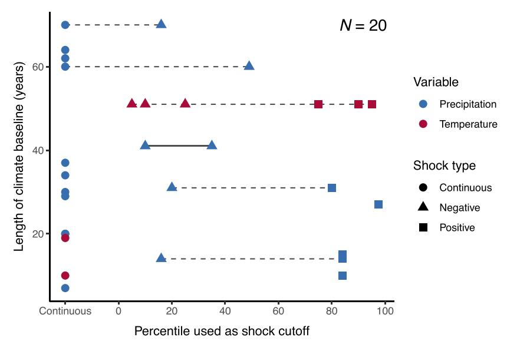

## Bibliographic metadata
doi: 10.1016/bs.hesecc.2024.10.001
authors: [Carleton, Duflo, Jack, Zappala]
title: Adaptation to climate change
year: 2024
venue: Handbook of the Economics of Climate Change
venue_type: book_chapter

## Plain-English synthesis
Carleton et al. review how economists define and estimate adaptation to climate change. Their central framework separates two channels: ex-post actions taken after a weather shock is realized, and ex-ante investments chosen before shocks arrive based on beliefs about future conditions. The framework is directly useful for the ozone-alert project because the pollution norm $P$ maps naturally to expectations and durable defensive stock $k$, while the daily shock $\epsilon_t$ maps to contemporaneous defensive action $b_t$. The chapter also warns that forecasts complicate identification: if people see forecasts before a "shock," then measured weather or pollution variation is not fully unexpected and may already include ex-ante adaptation. For this project, alerts are not just controls; they are information interventions that can change the decision environment and potentially shift both contemporaneous behavior and longer-run defensive investment.

## 1. Research question
The chapter asks how economists should define, measure, and evaluate climate adaptation, especially when adaptation occurs through both immediate responses to realized shocks and durable investments made before future weather is realized.

For this project, the most relevant question is how to map a theoretical decomposition of adaptation into an empirical design that separates expected pollution exposure, unexpected pollution shocks, and information interventions.

## 2. Audience
The chapter targets climate economists, environmental economists, development economists, and policy researchers evaluating adaptation policy and climate damages.

For this project, the relevant audience is researchers using climate-adaptation logic to interpret health behavior under expected and unexpected air pollution exposure.

## 3. Method / identification strategy
The chapter is a review and conceptual synthesis. It defines adaptation through a dynamic decision problem in which agents choose contemporaneous actions $b_t$ after weather $c_t$ is realized and durable investments $k$ before weather is realized.

The basic weather process can be written as:

$$
c_t = C + \epsilon_t,
$$

where $C$ is expected climate and $\epsilon_t$ is a transitory weather shock. This maps closely to the project's ozone decomposition $\rho_{it} = P_{im} + \epsilon_{it}$.

The chapter's climate-damage decomposition separates direct weather effects from ex-post and ex-ante adaptation terms:

$$
\frac{d[u_t]}{dC}
= u_c \frac{dc_t}{dC}
+ u_b \frac{db_t^*}{dc_t}\frac{dc_t}{dC}
+ u_k \frac{dk^*}{dC}.
$$

The project adapts this timing logic by treating $P_{im}$ as the expected pollution environment that can shape durable or anticipatory defensive action, while daily shocks affect contemporaneous responses.

## 4. Target parameter
The chapter does not estimate one parameter. Its target objects are the direct effect of weather or climate, the welfare contribution of ex-post adaptation, and the welfare contribution of ex-ante adaptation.

For the project, the closest empirical target is the gap between the health effect of unexpected daily ozone shocks and the health effect of expected ozone norms. That gap is interpreted as the net health contribution of ex-ante defensive action, conditional on the maintained conceptual model.

## 5. Data
The chapter is a review and uses no single dataset. It discusses evidence from agriculture, mortality, labor, energy, housing, finance, disaster policy, forecasts, and climate-risk information.

For this project, the useful data implication is that information variables must be measured explicitly. AQAD alerts and visibility controls help distinguish realized exposure, forecasted or visible exposure, and policy-provided information.

## 6. Statistical methods / specifications
The chapter compares several empirical strategies for estimating damages and adaptation:

- Ricardian or cross-sectional climate regressions, which may include long-run adaptation but are vulnerable to spatial omitted variables and forward-looking asset capitalization.
- Panel fixed-effects weather regressions, which have stronger short-run identification but usually capture realized-shock responses rather than long-run ex-ante adaptation.
- Heterogeneous short-run weather effects by long-run climate, which interprets different weather slopes across climates as evidence of ex-ante adaptation.
- Partitioning long-run climate variation from short-run weather deviations in one equation.
- Forecast-control approaches, which include observed forecasts to separate expected from unexpected weather variation.
- Structural and integrated assessment approaches, which model selected adaptation margins explicitly.

For the JMP, the closest relatives are the partitioning and forecast-control approaches: $P_{im}$ captures an expected exposure environment, $\epsilon_{it}$ captures deviations from that norm, and alerts capture a public information intervention.

## 7. Findings
The chapter's key conceptual finding is that ex-post and ex-ante adaptation are distinct channels. Ex-post adaptation responds after a shock is realized; ex-ante adaptation is chosen based on beliefs before shocks arrive.

A second key point is that forecasts can bias standard panel weather regressions if researchers interpret forecastable shocks as random surprises. Forecasts induce short-run ex-ante adaptation, so estimates that omit forecasts may mix direct effects with forecast-induced behavioral responses.

A third key point is that information can improve adaptation, but only when it is accurate, understood, and paired with feasible responses. Forecasts may fail to improve welfare if they are inaccurate, hard to interpret, or if households lack the resources or knowledge needed to act on them.

## 8. Contributions
The chapter gives the project a clean timing language: $k$ for durable ex-ante adaptation and $b_t$ for contemporaneous ex-post adaptation.

It also gives a warning for the alert design. Alerts are not simply nuisance variables; they are changes to the information environment. If alerts are triggered by forecastable pollution conditions, then the alert system may affect both measured health outcomes and the interpretation of pollution shocks.

Finally, it helps locate the project relative to climate econometrics: the ozone norm/shock design is a project-specific version of partitioning expected exposure from transitory deviations, with policy-provided forecasts layered on top.

## 9. Replication feasibility
There is no single replication archive for the review. The project can replicate the conceptual mapping by explicitly defining $P_{im}$, $\epsilon_{it}$, alert status $A_{it}$, and the timing of information available to agents.

Empirically, the crucial feasibility issue is whether alerts and visibility adequately proxy the information environment, and whether wind instruments can separately identify variation in norms and shocks.

## 10. Tables (project-relevance gated)
The chapter's tables are review tables summarizing adaptation studies and identification strategies. They are conceptually useful but not directly needed as machine-readable evidence for the project.

The most relevant table content is the classification of empirical approaches, especially partitioning variation, forecast controls, and intervention designs that alter information or beliefs.

## 11. Figures (project-relevance gated)
The chapter's conceptual figure distinguishing direct climate impacts, ex-post adaptation, and ex-ante adaptation is relevant to the project's theory section, but the text description is sufficient for wiki purposes.

The figure on sensitivity of weather-shock definitions is useful as a caution: empirical conclusions can depend on the baseline period and threshold used to define anomalies. For the project, this supports pre-specifying the ozone norm window and checking robustness to alternative norm definitions.

**Figure 1:** Map of studies examining adaptation interventions and weather anomalies (p. 188).

- Type: schematic / review-map
- One-liner: The review organizes adaptation-intervention studies by sector, exogenous variation, and weather anomaly definition.

**Figure 2:** Sensitivity of weather variation to functional form assumptions (p. 189).

- Type: line / sensitivity plot
- Key visual finding: The number of observed shocks changes sharply with the baseline climate window and percentile threshold, which supports robustness checks for the project's ozone norm window.

**Figure 3:** Studies of adaptation interventions by exogenous variation and sector (p. 199).

- Type: stacked bar chart
- Key visual finding: Information/beliefs are a major category of adaptation-intervention variation, making alerts and forecasts central rather than ancillary in the project's design.
