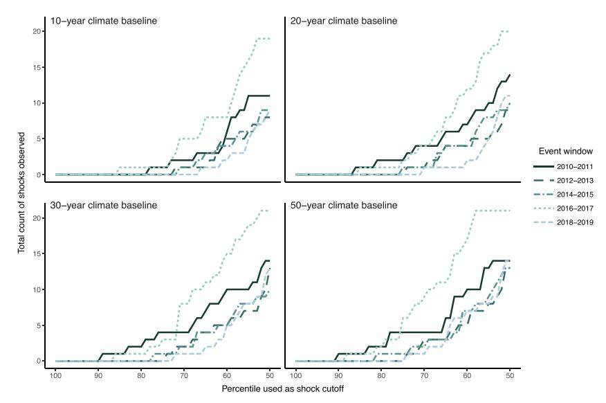
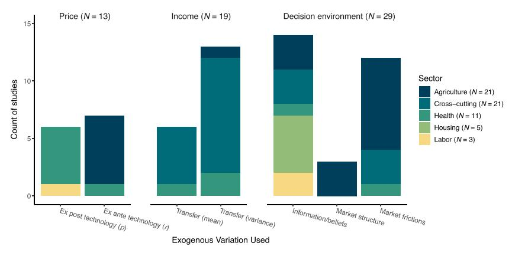

# Carleton Etal 2024 HESECC

**Summary**: Carleton et al. define climate adaptation through ex-post responses to realized shocks and ex-ante investments based on beliefs about future conditions (source: Carleton_etal_2024_HESECC.pdf). The chapter is central for the project's norm/shock conceptual framework and for thinking about forecasts, alerts, and identification (source: Carleton_etal_2024_HESECC.pdf).

**Sources**: Carleton_etal_2024_HESECC.pdf

**Last updated**: 2026-05-03

---

## Project-Relevant Takeaway

The chapter gives the project its adaptation timing structure. Ex-post adaptation is a contemporaneous response after a shock is realized; ex-ante adaptation is a durable investment chosen before shocks arrive, based on beliefs and information (source: Carleton_etal_2024_HESECC.pdf). In the ozone project, $P_{im}$ plays the role of expected exposure, $\epsilon_{it}$ plays the role of the realized shock, $k$ is the anticipatory defensive stock, and $b_t$ is contemporaneous defensive action (source: Carleton_etal_2024_HESECC.pdf).

## Two Adaptation Channels

The chapter's stylized weather process can be read as:

$$
c_t = C + \epsilon_t,
$$

where $C$ is expected climate and $\epsilon_t$ is a transitory shock (source: Carleton_etal_2024_HESECC.pdf). This is directly parallel to the project's ozone decomposition:

$$
\rho_{it} = P_{im} + \epsilon_{it}.
$$

The central decomposition separates direct exposure effects, ex-post responses, and ex-ante investments:

$$
\frac{d[u_t]}{dC}
= u_c \frac{dc_t}{dC}
+ u_b \frac{db_t^*}{dc_t}\frac{dc_t}{dC}
+ u_k \frac{dk^*}{dC}.
$$

For the project, the analogue is that expected ozone norms can change $k$, while realized daily shocks can change $b_t$ (source: Carleton_etal_2024_HESECC.pdf).

## Forecasts And Alerts

Forecasts are identification-relevant because forecastable weather shocks are not fully unanticipated (source: Carleton_etal_2024_HESECC.pdf). If agents change behavior in response to forecasts, a panel regression that treats realized weather as random may mix direct exposure effects with forecast-induced adaptation (source: Carleton_etal_2024_HESECC.pdf).

This is directly relevant to AQAD alerts. Alerts are public information interventions, not just controls. If alerts are triggered by forecasted ozone, then they can shift contemporaneous defensive action $b_t$ and possibly longer-run beliefs about $P_{im}$ (source: Carleton_etal_2024_HESECC.pdf). The project should therefore treat alert status and alert interactions as part of the decision environment.

## Identification Strategies Reviewed

Carleton et al. contrast several approaches (source: Carleton_etal_2024_HESECC.pdf):

- Ricardian or cross-sectional climate regressions may include long-run adaptation but face spatial omitted-variable and forward-looking capitalization problems.
- Panel fixed-effects weather regressions have stronger short-run identification but usually capture responses to realized shocks rather than full ex-ante adaptation.
- Heterogeneity by long-run climate uses different short-run weather slopes across climates as evidence of adaptation, but it depends on whether baseline climate proxies beliefs and investment.
- Partitioning long-run climate and short-run deviations is closest to the project's norm/shock design.
- Forecast controls isolate unexpected realized variation from expected or forecasted variation that may already have induced adaptation.

## Figures

**Figure 2:** Sensitivity of weather variation to functional form assumptions (p. 189) (source: Carleton_etal_2024_HESECC.pdf)

- Key visual finding: The number of observed shocks varies substantially with the baseline climate window and percentile cutoff, which makes the project's ozone norm-window choice identification-relevant (source: Carleton_etal_2024_HESECC.pdf).

**Figure 3:** Studies of adaptation interventions by exogenous variation and sector (p. 199) (source: Carleton_etal_2024_HESECC.pdf)

- Key visual finding: Information and beliefs are a major class of adaptation-intervention variation, supporting the treatment of AQAD alerts as information interventions rather than simple nuisance controls (source: Carleton_etal_2024_HESECC.pdf).

## Project Implications

The chapter supports the project's conceptual distinction between intrinsic ex-ante defensive action and alert-induced defensive action (source: Carleton_etal_2024_HESECC.pdf). It also sharpens the identification threat: if the "shock" component is forecastable, $\epsilon_{it}$ is not purely unexpected from the agent's point of view (source: Carleton_etal_2024_HESECC.pdf). Visibility controls, alert variables, and weather forecasts are therefore not optional if the goal is to interpret $\beta^S - \beta^N$ as a behavioral adaptation object.

## Related pages

- [[ex-ante-ex-post-adaptation]]
- [[forecasts-alerts-and-identification]]
- [[health-production-and-adaptation]]
- [[grossman-1972-jpe]]
