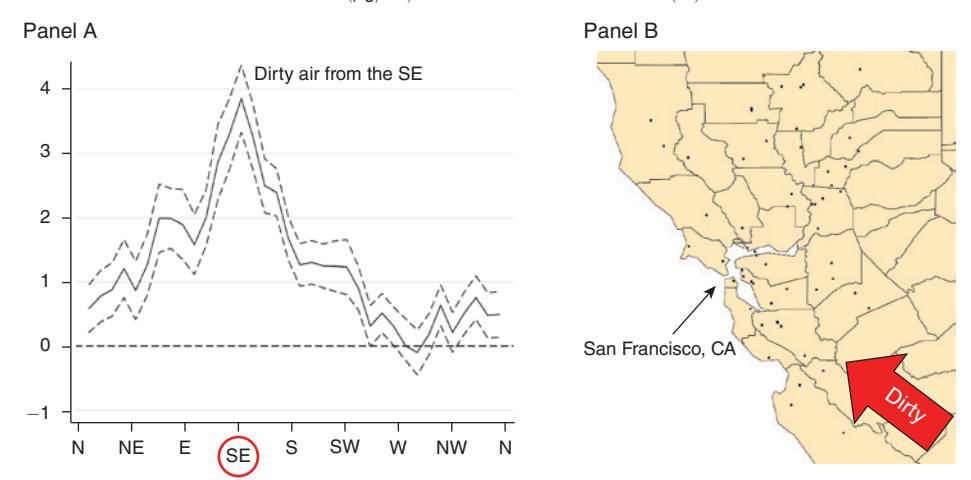
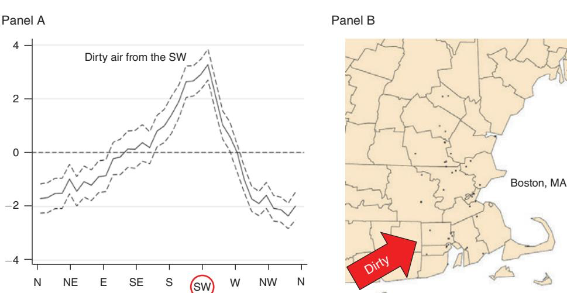
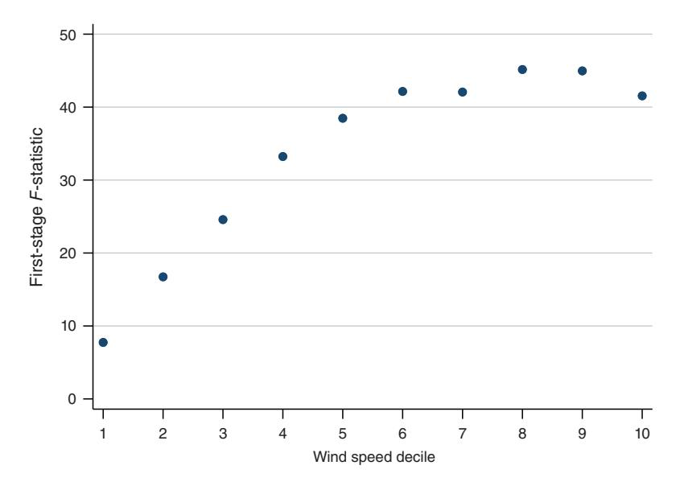

# Deryugina Etal 2019 AER

**Summary**: Deryugina et al. estimate acute PM2.5 effects using daily wind direction as an instrument, with geography-specific first stages and extensive robustness checks (source: Deryugina_etal_2019_AER.pdf). The paper is most useful here as a template for [[wind-direction-instruments]], [[monitor-group-first-stage]], and [[adapting-wind-iv-to-ozone-shocks]] (source: Deryugina_etal_2019_AER.pdf).

**Sources**: Deryugina_etal_2019_AER.pdf

**Last updated**: 2026-05-03

---

## Project-Relevant Takeaway

Deryugina et al. use changes in daily wind direction to instrument for daily county PM2.5, arguing that the design scales across many counties without requiring source-by-source knowledge of local emissions geography (source: Deryugina_etal_2019_AER.pdf). Their identifying assumption is that, conditional on fixed effects and flexible climatic controls, wind direction affects elderly mortality and health care use only through air pollution (source: Deryugina_etal_2019_AER.pdf). This is directly relevant to an ozone project because wind can shift pollutant exposure, but the ozone adaptation must address photochemical formation, sunlight, temperature, precursors, and alert-policy timing (source: Deryugina_etal_2019_AER.pdf).

## Identification Design

The outcome equation relates county-day health outcomes to PM2.5, controls, county fixed effects, state-by-month fixed effects, and month-by-year fixed effects (source: Deryugina_etal_2019_AER.pdf). The first stage interacts wind-direction bins with spatial monitor groups so that wind-pollution relationships vary across geography (source: Deryugina_etal_2019_AER.pdf). The authors divide daily wind direction into 90-degree bins and omit the $[270,360)$ bin (source: Deryugina_etal_2019_AER.pdf).

$$
PM2.5_{cdmy}
= \sum_{g \in G} \sum_{b=0}^{2} \beta_b^g \mathbf{1}[G_c=g] \times WINDDIR_{cdmy}^{90b}
+ X'_{cdmy}\sigma + \alpha_c + \alpha_{sm} + \alpha_{my} + \epsilon_{cdmy}.
$$

The monitor groups are built with $k$-means clustering on monitor locations, and the preferred design uses 100 spatial groups, yielding 93 PM2.5 monitor groups in the final sample (source: Deryugina_etal_2019_AER.pdf). This grouping is meant to filter out monitor-specific local-source variation and retain wind-driven variation that affects a wider area more uniformly (source: Deryugina_etal_2019_AER.pdf).

## Data Requirements

The paper combines EPA AQS pollution monitors, NARR wind vector fields, gridded temperature and precipitation, Medicare mortality records, MedPAR inpatient claims, and outpatient emergency room claims (source: Deryugina_etal_2019_AER.pdf). Wind data are interpolated from NARR grid points to pollution monitors, converted from vector components into wind direction and wind speed, and then averaged to county-day (source: Deryugina_etal_2019_AER.pdf). Wind direction is defined as the direction the wind is blowing from (source: Deryugina_etal_2019_AER.pdf).

## Controls and Timing

The preferred specification includes county, state-by-month, and month-by-year fixed effects (source: Deryugina_etal_2019_AER.pdf). Weather controls are flexible interactions among binned maximum temperature, binned minimum temperature, precipitation deciles, and wind-speed deciles (source: Deryugina_etal_2019_AER.pdf). The three-day outcome window motivates including two leads of weather controls and two leads of instruments in IV specifications (source: Deryugina_etal_2019_AER.pdf). The authors also include two lags of the instruments to reduce autocorrelation concerns (source: Deryugina_etal_2019_AER.pdf).

## Figures

**Figure 2:** Relationship between Daily Average Wind Direction and PM2.5 Concentrations for Counties in and around the Bay Area, CA (p. 6) (source: Deryugina_etal_2019_AER.pdf)  

- Key visual finding: PM2.5 is highest under southeastern winds and lowest under western and northern winds, consistent with upwind pollution transport patterns in the Bay Area (source: Deryugina_etal_2019_AER.pdf).
- **Figure notes:** Panel A uses 10-degree wind-direction bins and controls for county, month-by-year, state-by-month fixed effects, and flexible weather controls (source: Deryugina_etal_2019_AER.pdf).

**Figure 3:** Relationship between Daily Average Wind Direction and PM2.5 Concentrations for Counties in and around the Greater Boston Area, MA (p. 7) (source: Deryugina_etal_2019_AER.pdf)  

- Key visual finding: PM2.5 is highest when wind comes from the southwest and lowest when wind comes from cleaner ocean or less populated directions (source: Deryugina_etal_2019_AER.pdf).
- **Figure notes:** The figure uses the same 10-degree-bin regression structure as the Bay Area figure (source: Deryugina_etal_2019_AER.pdf).

**Figure 7:** Relationship between the Strength of the First Stage and Wind Speed (p. 35) (source: Deryugina_etal_2019_AER.pdf)  

- Key visual finding: The first stage is weakest on low-wind-speed days and strongest in higher-wind-speed subsamples, supporting the transported-pollution interpretation (source: Deryugina_etal_2019_AER.pdf).
- **Figure notes:** Each first-stage regression uses only the county-days in one wind-speed decile (source: Deryugina_etal_2019_AER.pdf).

## Tables

Table 8 shows that the PM2.5 mortality effect remains significant after adding wind-instrumented CO and ozone, though first-stage $F$-statistics fall from above 130 in single-pollutant specifications to 27-35 in specifications with PM2.5, CO, and ozone together (source: Deryugina_etal_2019_AER.pdf). Table 9 shows similar mortality estimates when changing wind-bin size, changing the number of monitor groups, and interacting instruments with season (source: Deryugina_etal_2019_AER.pdf). Table 10 shows the mortality IV estimate remains positive across different weather-control and fixed-effect structures (source: Deryugina_etal_2019_AER.pdf). Table 11 shows estimates are stable when using zero, one, three, four, or five instrument lags instead of the preferred two-lag specification (source: Deryugina_etal_2019_AER.pdf).

## Implications for the JMP

The paper supports a design in which daily wind direction instruments transitory pollution exposure while long-run or seasonal pollution norms enter separately as controls or interactions (source: Deryugina_etal_2019_AER.pdf). For an ozone alert design, the closest adaptation is to instrument the ozone shock component with wind-direction variation while controlling for the ozone norm, weather, visibility, fixed effects, alert status, and alert interactions (source: Deryugina_etal_2019_AER.pdf). The multi-pollutant table warns that adding co-transported pollutants can weaken first stages, which matters if ozone, PM2.5, and precursors are jointly instrumented (source: Deryugina_etal_2019_AER.pdf).

## Related pages

- [[wind-direction-instruments]]
- [[monitor-group-first-stage]]
- [[wind-iv-identification-assumptions]]
- [[wind-iv-late-monotonicity]]
- [[multi-pollutant-wind-iv]]
- [[adapting-wind-iv-to-ozone-shocks]]
